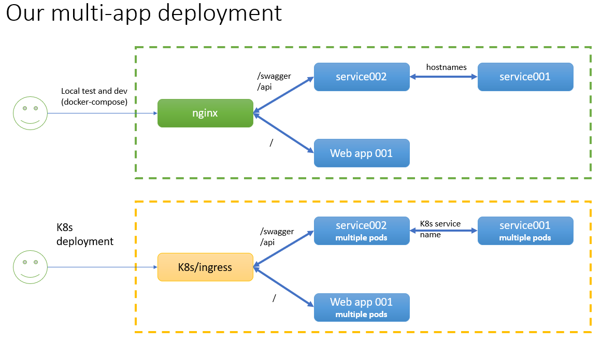

# docker compose with multiple apps
# + equivalent kubernetes deployment

* In this deployment, the user enters from the nginx:80
* then the locations are mentioned as follows
> 1. /app points to independent webapp
> 2. /swagger points to a dotnet webapi, that internally fetches the data from a python webapi
> 3. /api points to the above dotnet webapi
> 4. The python webapi, that empowers the above dotnet app, docker-compose also runs that

## System design

